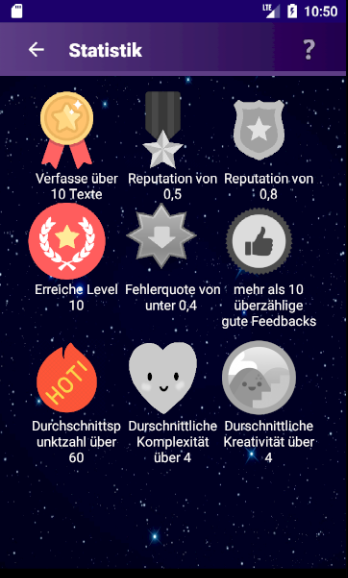
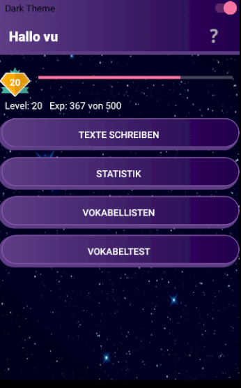
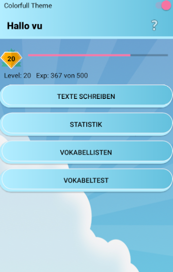
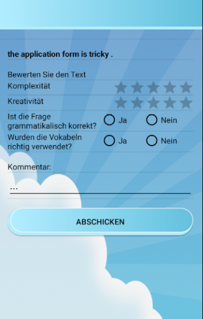

# vocality_android
Vocabulary trainer for android

## Demo

  
  
  
  
  
    

## Features

Android application for vocabulary training. 
- The app has two modes: student and teacher. 
- Questions and Exercises will be evaluated by other student throught peer-assessment approach
- Gamifified design with light and dark mode

## Technologies

- Java
- Android Studio
- Firebase

