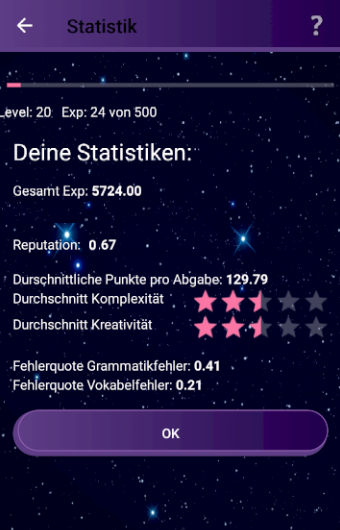

# vocality_android
Vocabulary trainer for android

## Demo

<p align="center">
  
  
  
</p>

  
  
    

## Features

image voting side with vanilla php and js
- optimized for mobile use
- with score board to show users the current top picks
- added cookies to prevent (with reasonalble effort) users from voting multiple times
- added images and topimages side for data analysis

## Installation

1. Clone the repository:

   ```bash
   git clone https://github.com/nicolaaaa/q216_voting_site.git
   ```
2. Install Docker and Docker-Compose
3. Run the following command in the root directory of the project:
   ```bash
   docker-compose up
   ```
4. Open the `localhost:8080` in your browser.

## Technologies Used

- Docker
- HTML
- CSS
- JavaScript
- PHP
- MYSQL
- NGINX